---
## Author
author:
  name: Седохин Даниил Алексеевич
  degrees: DSc
  orcid: 0000-0002-0877-7063
  email: 1132231845@pfur.ru
  affiliation:
    - name: Российский университет дружбы народов
      country: Российская Федерация
      postal-code: 117198
      city: Москва
      address: ул. Миклухо-Маклая, д. 6

## Title
title: "Отчёт по лабораторной работе 5"
subtitle: "Простые сети в GNS3. Анализ трафика"
license: "CC BY"
---

# Цель работы

Построение простейших моделей сети на базе коммутатора и маршрутизаторов FRR и VyOS в GNS3, анализ трафика посредством Wireshark.

# Задание

1. Построить в GNS3 топологию сети, состоящей из коммутатора Ethernet и двух
оконечных устройств (персональных компьютеров).

2. Задать оконечным устройствам IP-адреса в сети 192.168.1.0/24. Проверить
связь.

# Выполнение лабораторной работы

Запустим GNS3 VM и GNS3 и воспроизведем топологию сети.
([рис. @fig-001]).

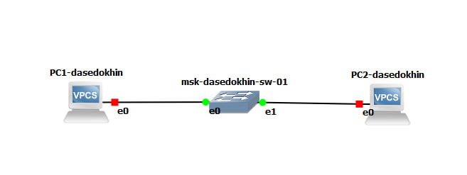{#fig-001 width=70%}

Теперь зададим IP-адреса для устройств PC1 и PC2
([рис. @fig-002]).

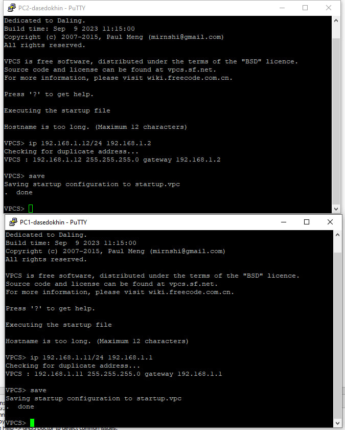{#fig-002 width=70%}

Проверим работоспособность соединения между PC-1 и PC-2 с помощью
команды ping.
([рис. @fig-003]).

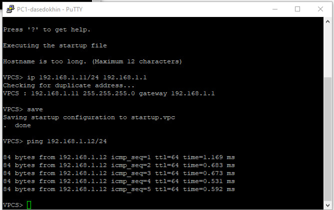{#fig-003 width=70%}

Запустим захват трафика на соединении между PC1 и коммутатором и запустим все узлы в проекте.
([рис. @fig-004]).

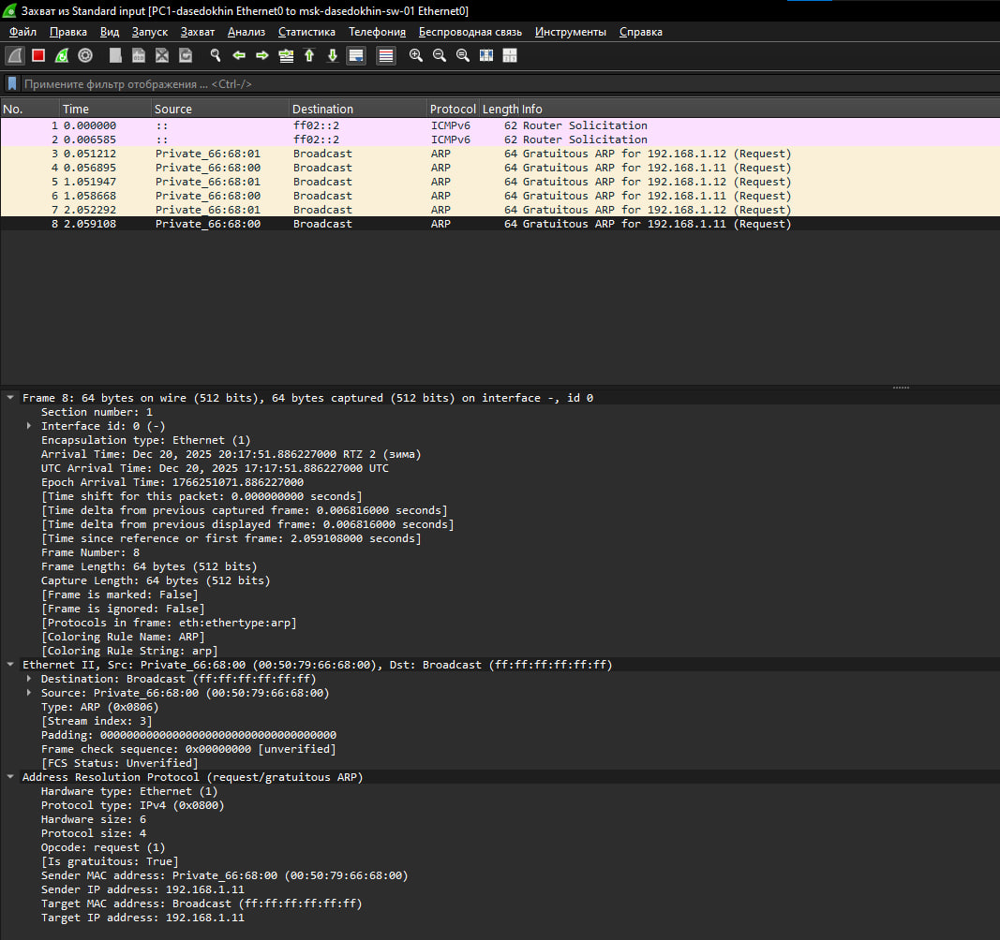{#fig-004 width=70%}

В терминале PC-2 посмотрим информацию по опциям команды ping, введя

ping /?
([рис. @fig-005]).

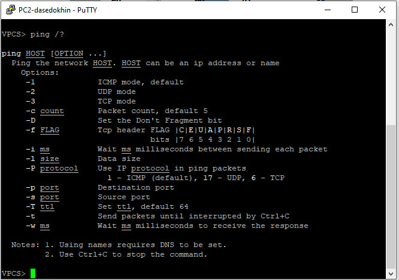{#fig-005 width=70%}

Затем сделаем один эхо-запрос в ICMP-моде к узлу PC-1
([рис. @fig-006]).

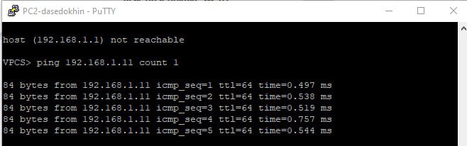{#fig-006 width=70%}

Просмотр пакетов ICMP
([рис. @fig-007]).

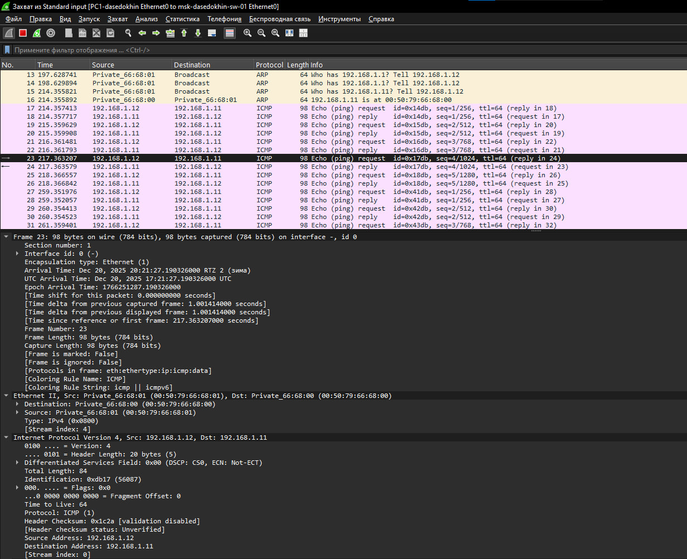{#fig-007 width=70%}

Теперь сделаем запросы в UDP моде и в TCP моде к узлу PC1.
([рис. @fig-008]).

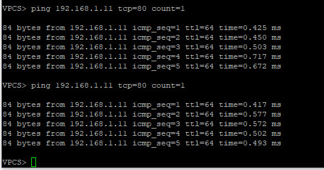{#fig-008 width=70%}

Воспроизведем новую топологию сети в новом проекте
([рис. @fig-009]).

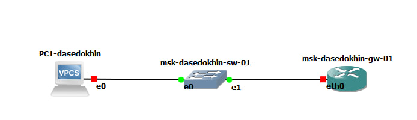{#fig-009 width=70%}

Включим захват трафика на соединении между коммутатором и маршрутизатором.
([рис. @fig-010]).

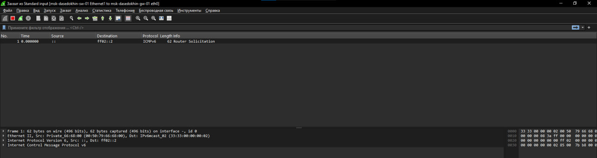{#fig-010 width=70%}

Запустим все узлы и настроим IP-адресацию для интерфейса узла PC1:

ip 192.168.1.10/24 192.168.1.1

save

show ip
([рис. @fig-011]).

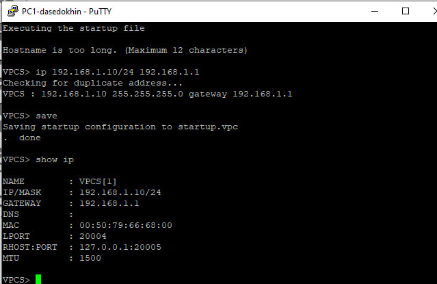{#fig-011 width=70%}

Настроим IP-адресацию для интерфейса локальной сети маршрутизатора:

Router# configure terminal

Router(config)# hostname msk-user-gw-01

msk-user-gw-01(config)# exit

msk-user-gw-01# write memory

msk-user-gw-01# configure terminal

msk-user-gw-01(config)# interface eth0

msk-user-gw-01(config-if)# ip address 192.168.1.1/24

msk-user-gw-01(config-if)# no shutdown

msk-user-gw-01(config-if)# exit

msk-user-gw-01(config)# exit

msk-user-gw-01# write memory
([рис. @fig-012]).

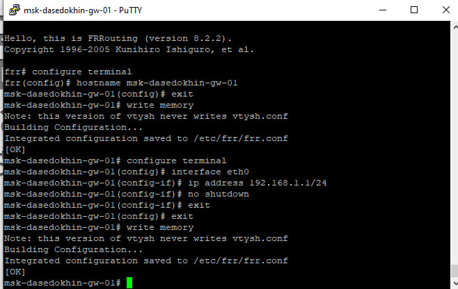{#fig-012 width=70%}

Проверим конфигурацию маршрутизатора и настройки IP-адресации:

msk-user-gw-01# show running-config

msk-user-gw-01# show interface brief
([рис. @fig-013]).

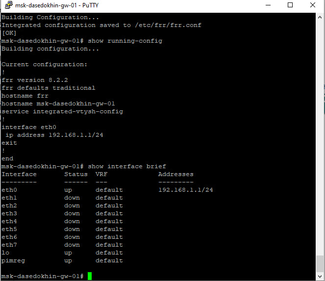{#fig-013 width=70%}

Проверим подключение. Узел PC1 должен успешно отправлять эхо-запросы
на адрес маршрутизатора 192.168.1.1.
([рис. @fig-014]).

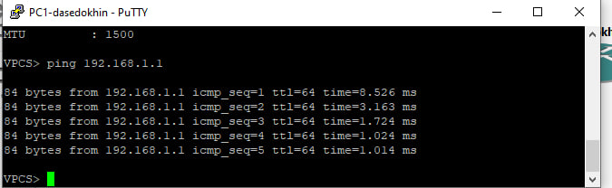{#fig-014 width=70%}

В окне Wireshark проанализируем полученную информацию
([рис. @fig-015]).

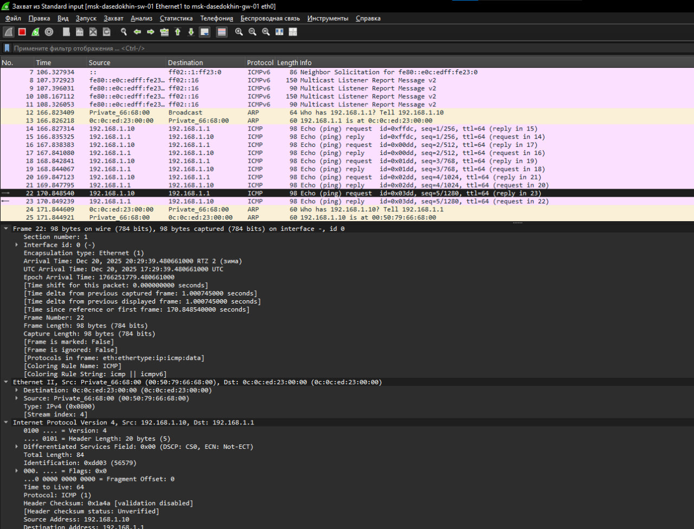{#fig-015 width=70%}

Создадим новый проект и воспроизведем топлогию сети.
([рис. @fig-016]).

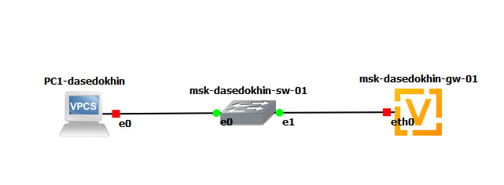{#fig-016 width=70%}

Настроим IP-адресацию для интерфейса узла PC1:

ip 192.168.1.10/24 192.168.1.1

save

show ip
([рис. @fig-017]).

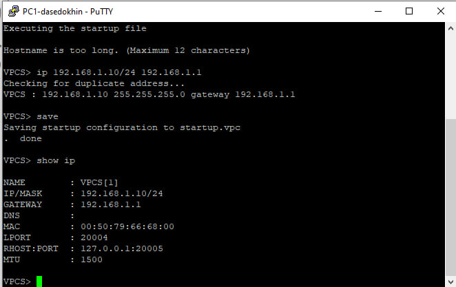{#fig-017 width=70%}

Настроим маршрутизатор VyOS:

– После загрузки введем логин vyos и пароль vyos:

vyos login: vyos

Password:

В рабочем режиме в командной строке отображается символ $.

– Установим систему на диск:

vyos@vyos:~$ install image
([рис. @fig-018]).

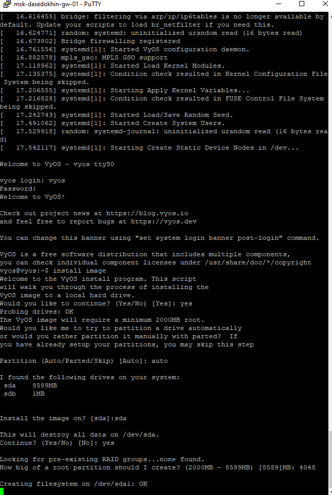{#fig-018 width=70%}

Перейдем в режим конфигурирования:

vyos@vyos$ configure

vyos@vyos#

– Изменим имя устройства

vyos@vyos#set system host-name msk-user-gw-01

Изменения в имени устройства вступят в силу после применения и сохранения конфигурации и перезапуска устройства.

– Зададим IP-адрес на интерфейсе eth0:

vyos@vyos# set interfaces ethernet eth0 address 192.168.1.1/24

– Посмотрим внесённые в конфигурацию изменения:

vyos@vyos# compare

– Применим изменения в конфигурации и сохраним саму конфигурацию:

vyos@vyos# commit

vyos@vyos# save

– Посмотрим информацию об интерфейсах маршрутизатора:

vyos@vyos# show interfaces

– Выйдем из режима конфигурирования:

vyos@vyos# exit

vyos@vyos$
([рис. @fig-019]).

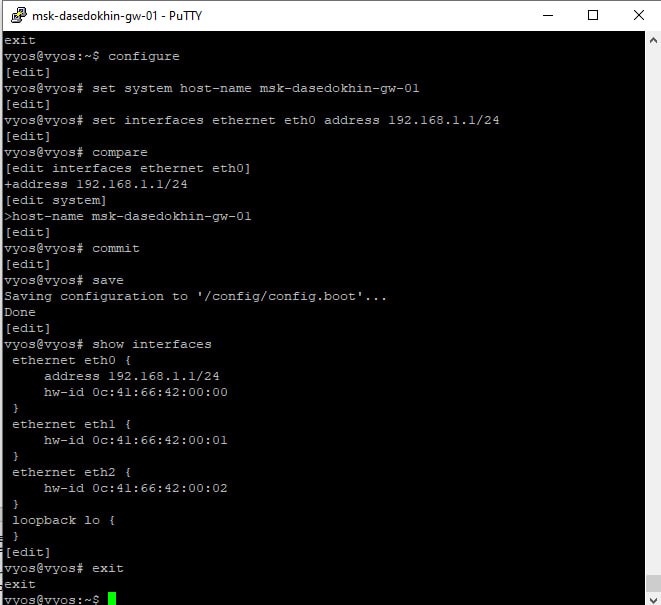{#fig-019 width=70%}

Проверим подключение. Узел PC1 должен успешно отправлять эхо-запросы
на адрес маршрутизатора 192.168.1.1
([рис. @fig-020]).

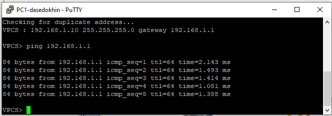{#fig-020 width=70%}

Анализ пакетов.
([рис. @fig-021]).

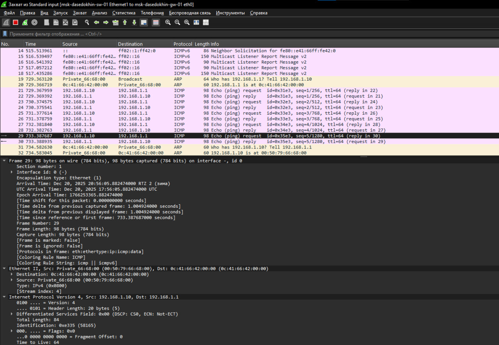{#fig-021 width=70%}

# Выводы

Я построил простейшие моделей сети на базе коммутатора и маршрутизаторов FRR и VyOS в GNS3, проанализировал трафик посредством Wireshark.
