---
## Author
author:
  name: Седохин Даниил Алексеевич
  degrees: DSc
  orcid: 0000-0002-0877-7063
  email: 1132231845@pfur.ru
  affiliation:
    - name: Российский университет дружбы народов
      country: Российская Федерация
      postal-code: 117198
      city: Москва
      address: ул. Миклухо-Маклая, д. 6

## Title
title: "Отчёт по лабораторной работе 7"
subtitle: "Адресация IPv4 и IPv6. Настройка DHCP"
license: "CC BY"
---

# Цель работы

Получение навыков настройки службы DHCP на сетевом оборудовании для распределения адресов IPv4 и IPv6.

# Задание

Задана топология сети (рис. 7.1) и сведения по адресному пространству сети
(табл. 7.1).

Требуется настроить на маршрутизаторе, имеющим адрес 10.0.0.1, DHCPсервис по распределению IPv4-адресов из диапазона 10.0.0.2 – 10.0.0.253, настроить получение адреса по DHCP на узле (PC), а также исследовать пакеты
DHCP.

Требуется:

– на интерфейсе марштрутизатора eth1 настроить DHCPv6 без отслеживания

состояния;
– на интерфейсе марштрутизатора eth2 настроить DHCPv6 с учётом отслеживания состояния.

# Выполнение лабораторной работы

Запустим GNS3 VM и GNS3. Создадим новый проект.

В рабочем пространстве разместим и соединим устройства в соответствии
с топологией, приведённой на рис. 7.1. Используем маршрутизатор VyOS
и хост (клиент) VPCS.

Изменим отображаемые названия устройств. Коммутаторам присвоим названия по принципу username-sw-0x, маршрутизаторам — по принципу
username-gw-0x, VPCS — по принципу PCx-username, где вместо username
укажем dasedokhin, вместо x — порядковый номер устройства.
([рис. @fig-001]).

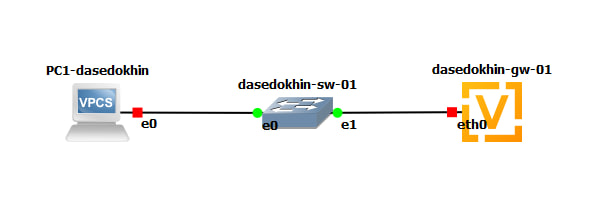{#fig-001 width=70%}

Включим захват трафика на соединении между коммутатором sw-01 и маршрутизатором gw-01.
([рис. @fig-002]).

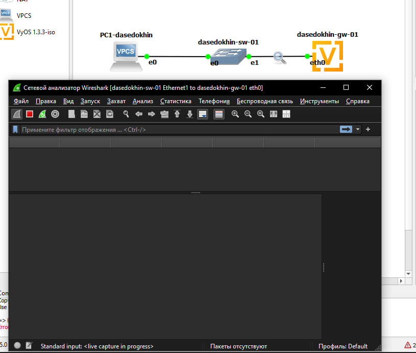{#fig-002 width=70%}

Настроим образ VyOS (для входа в систему используйте логин vyos и пароль
vyos):

– Установите систему на маршрутизаторы VyOS:

vyos@vyos:~$ install image

Далее ответьте на вопросы диалога установки. По завершении диалога
перезапустите маршрутизатор, введя команду reboot.

– На маршрутизаторах перейдите в режим конфигурирования, измените
имя устройства и доменное имя, замените системного пользователя, заданного по умолчанию, на вашего пользователя (вместо username укажите
имя вашей учётной записи, вместо <mysecurepassword> — пароль для
доступа к устройству, например 123456 или любой другой):

vyos@vyos$ configure

vyos@vyos# set system host-name username-gw-01

vyos@vyos# set system domain-name username.net

vyos@vyos# set system login user <username> authentication plaintext-password <mysecurepassword>

vyos@vyos# commit

vyos@vyos# save

vyos@vyos# exit

vyos@vyos$ exit

username-gw-01 login: username

Password:

username@username-gw-01:~$ configure

username@username-gw-01# delete system login user vyos

username@username-gw-01# commit

username@username-gw-01# save
([рис. @fig-003]).

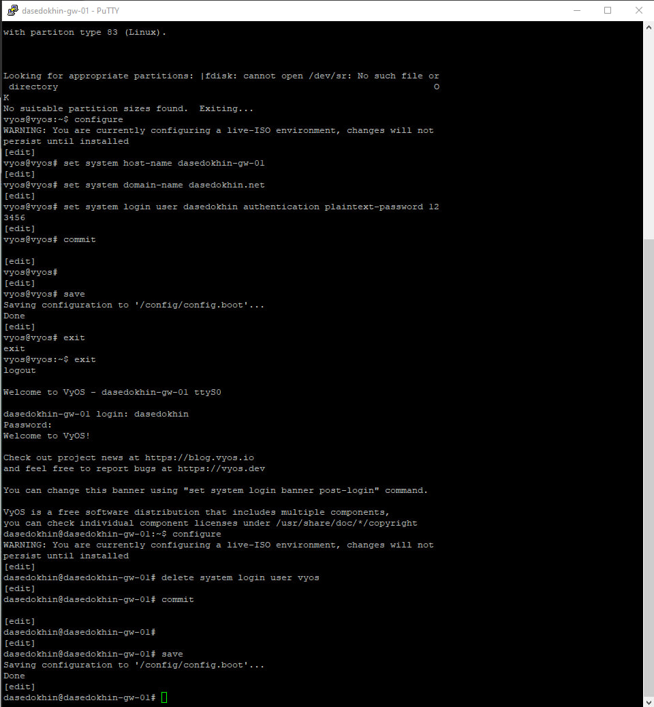{#fig-003 width=70%}

 На маршрутизаторе под созданным пользователем перейдите в режим конфигурирования и настройте адресацию IPv4:
username@username-gw-01# set interfaces ethernet eth0 address 10.0.0.1/24
7. Добавьте конфигурацию DHCP-сервера на маршрутизаторе (вместо username
укажите имя вашей учётной записи):

username@username-gw-01# set service dhcp-server shared-network-name username domain-name username.net

username@username-gw-01# set service dhcp-server shared-network-name username name-server 10.0.0.1

username@username-gw-01# set service dhcp-server

shared-network-name username subnet 10.0.0.0/24

default-router 10.0.0.1 username@username-gw-01# set service dhcp-server

shared-network-name username subnet 10.0.0.0/24 range

hosts start 10.0.0.2 username@username-gw-01# set service dhcp-server

shared-network-name username subnet 10.0.0.0/24 range

hosts stop 10.0.0.253 username@username-gw-01# commit

username@username-gw-01# save

username@username-gw-01# exit

Здесь при помощи указанных выше команд была создана разделяемая сеть
(shared-network-name) с названием username, подсеть (subnet) с адресом
10.0.0.0/24, задан диапазон адресов (range) с именем hosts, содержащий
адреса 10.0.0.2–10.0.0.253.
([рис. @fig-004]).

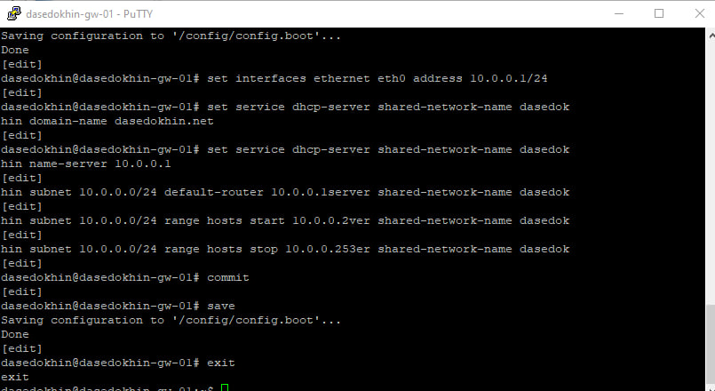{#fig-004 width=70%}

Для просмотра статистики DHCP-сервера и выданных адресов используйте
команды:

username@username-gw-01$ show dhcp server statistics

username@username-gw-01$ show dhcp server leases
([рис. @fig-005]).

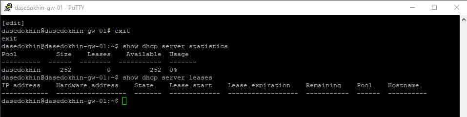{#fig-005 width=70%}

Настройте оконечное устройство PC1:

PC1-username> ip dhcp -d
([рис. @fig-006]).

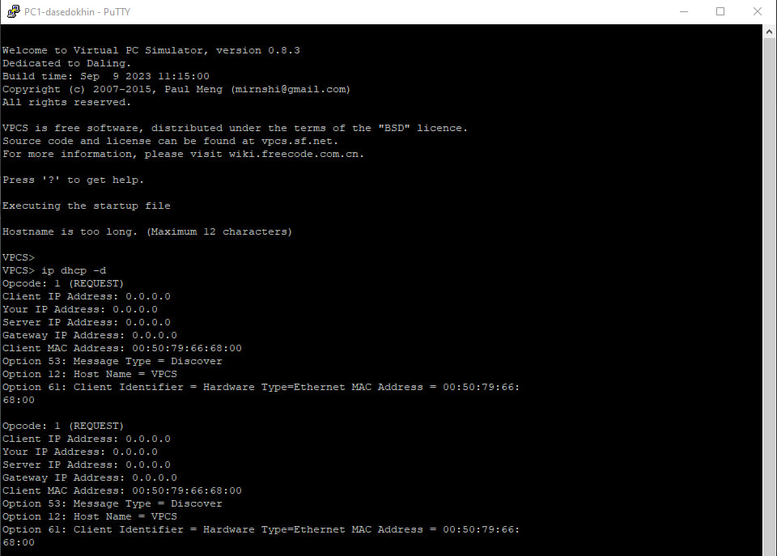{#fig-006 width=70%}

PC1-username> save

Здесь использована опция -d для обеспечения возможности просмотра декодированных запросов DHCP. В отчёте поясните полученную на экране PC1
информацию.
([рис. @fig-007]).

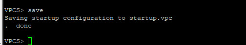{#fig-007 width=70%}

Проверьте конфигурацию IPv4 на узле, пропингуйте маршрутизатор:

PC1-username> show ip

PC1-username> ping 10.0.0.1 -c 2
([рис. @fig-008]).

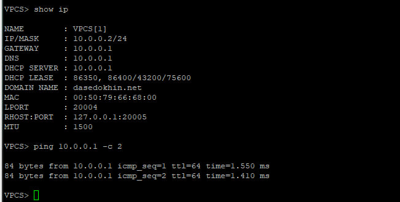{#fig-008 width=70%}

На маршрутизаторе вновь посмотрите статистику DHCP-сервера и выданные
адреса, в отчёте поясните полученную информацию:

username@username-gw-01$ show dhcp server statistics

username@username-gw-01$ show dhcp server leases

На маршрутизаторе посмотрите журнал работы DHCP-сервера:

username@username-gw-01$ show log | grep dhcp
([рис. @fig-009]).

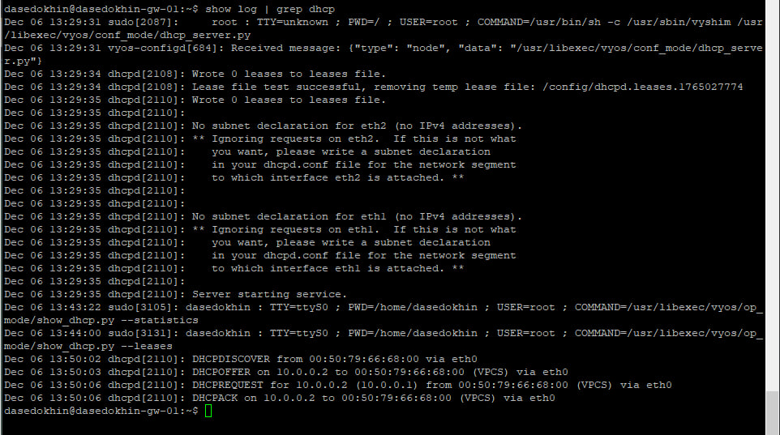{#fig-009 width=70%}

В предыдущем проекте в рабочем пространстве дополните сеть, разместив
и соединив устройства в соответствии с топологией, приведённой на рис. 7.2.
Используйте хост (клиент) Kali Linux CLI (добавьте образ Kali Linux CLI в перечень устройств в GNS3), поскольку клиент VPCS не поддерживает DHCPv6.
Измените отображаемые названия устройств. Коммутаторам присвойте названия по принципу username-sw-0x, маршрутизаторам — по принципу
username-gw-0x, VPCS — по принципу PCx-username, где вместо username
укажите имя вашей учётной записи, вместо x — порядковый номер устройства.
([рис. @fig-010]).

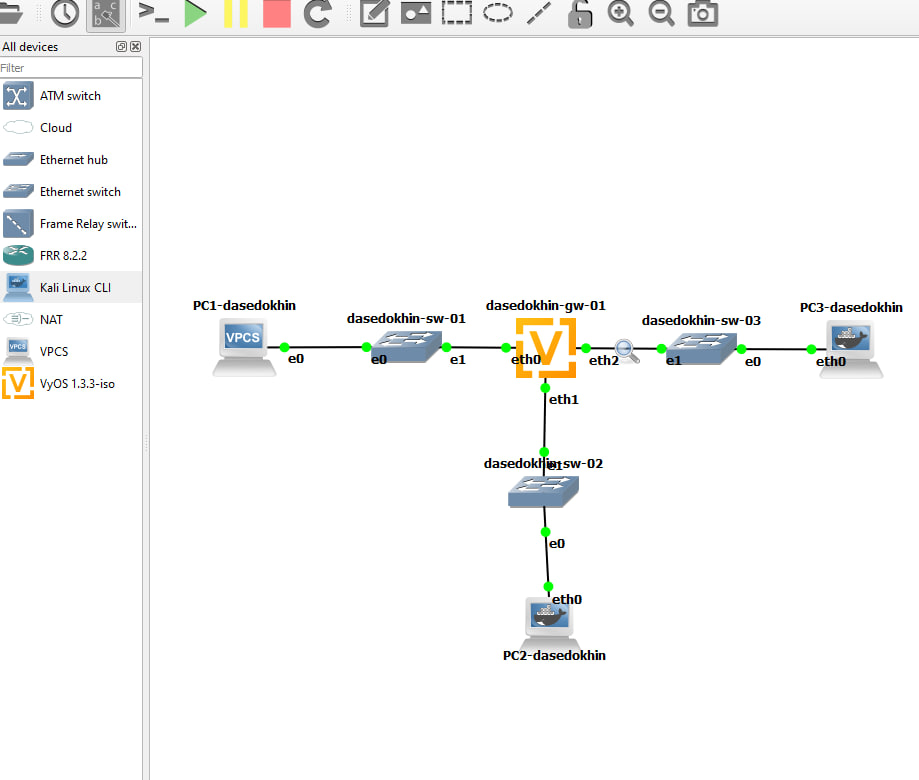{#fig-010 width=70%}

Включите захват трафика на соединениях между маршрутизатором gw-01
и коммутаторами sw-02 и sw-03.

Настройте адресацию IPv6 на маршрутизаторе:

username@username-gw-01:~$ configure

username@username-gw-01# set interfaces ethernet eth1 address 2000::1/64

username@username-gw-01# set interfaces ethernet eth2 address 2001::1/64

username@username-gw-01# show interfaces

username@username-gw-01# commit

username@username-gw-01# save
([рис. @fig-011]).

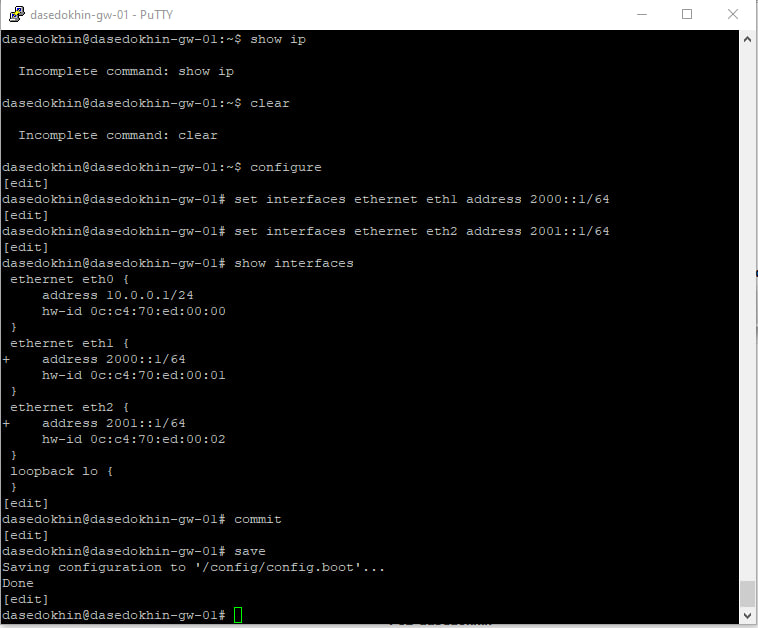{#fig-011 width=70%}

На маршрутизаторе настройте DHCPv6 без отслеживания состояния (DHCPv6
Stateless configuration):

– Настройка объявления о маршрутизаторах (Router Advertisements, RA) на
интерфейсе eth1:

username@username-gw-01# set service router-advert interface eth1 prefix 2000::/64

username@username-gw-01# set service router-advert interface eth1 other-config-flag

Опция other-config-flag означает, что для конфигурации не адресных
параметров использует протокол с сохранением состояния.

– Добавление конфигурации DHCP-сервера (вместо username укажите имя
вашей учётной записи):

username@username-gw-01# set service dhcpv6-server shared-network-name username-stateless

username@username-gw-01# set service dhcpv6-server

shared-network-name username-stateless subnet
2000::0/64 username@username-gw-01# set service dhcpv6-server

shared-network-name username-stateless common-options name-server 2000::1username@username-gw-01# set service dhcpv6-server

shared-network-name username-stateless common-options domain-search username.net username@username-gw-01# commit

username@username-gw-01# save

username@username-gw-01# run show configuration

Здесь с помощью указанных выше команд создана разделяемая сеть (sharednetwork-name) с названием username, задана информация общих опций (common-options) для разделяемой сети. При этом подсеть (subnet)
2000::/64 не требуется настраивать, поскольку она не будет содержать
полезной информации.
([рис. @fig-012]).

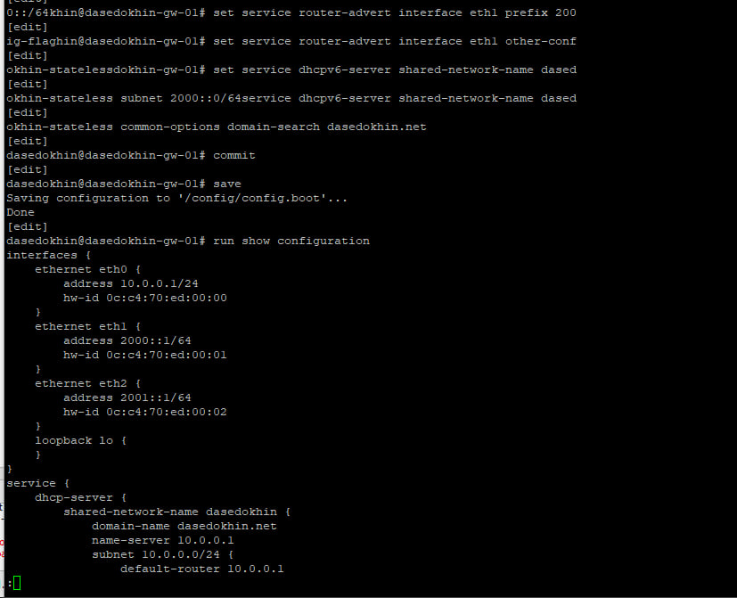{#fig-012 width=70%}

На узле PC2 проверьте настройки сети:

root@PC2-username:/# ifconfig

root@PC2-username:/# route -n -A inet6
([рис. @fig-013]).

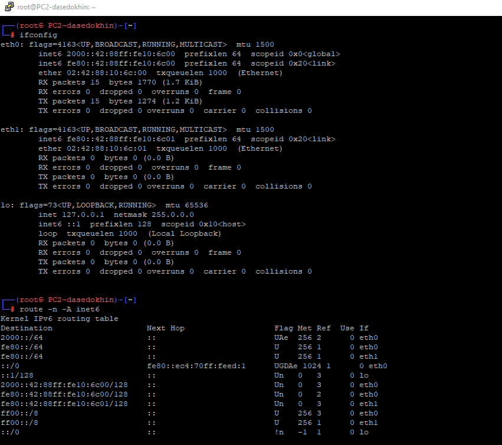{#fig-013 width=70%}

На узле PC2 пропингуйте маршрутизатор:

root@PC2-username:/# ping 2000::1 -c 2

На узле PC2 проверьте настройки DNS:

root@PC2-username:/# cat /etc/resolv.conf

 На узле PC2 получите адрес по DHCPv6:

root@PC2-username:/# dhclient -6 -S -v eth0

Здесь опция -6 указывает на использование протокола DHCPv6, опция -S —
на запрос только информации DHCPv6, но не адреса, опция -v — на вывод на
экран подробной информации.
([рис. @fig-014]).

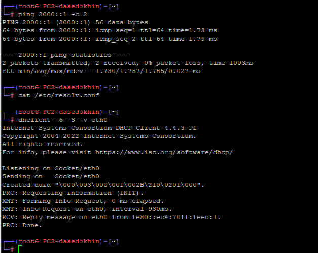{#fig-014 width=70%}

Вновь пропингуйте от узла PC2 маршрутизатор, проверьте настройки DNS:

root@PC2-username:/# ping 2000::1 -c2

root@PC2-username:/# cat /etc/resolv.conf
([рис. @fig-015]).

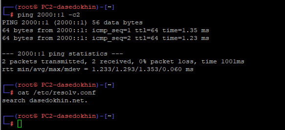{#fig-015 width=70%}

На маршрутизаторе посмотрите статистику DHCP-сервера и выданные адреса

username@username-gw-01# run show dhcpv6 server leases
([рис. @fig-016]).

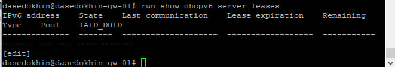{#fig-016 width=70%}

На маршрутизаторе настройте DHCPv6 с отслеживанием состояния (DHCPv6
Stateful configuration):

– На интерфейсе eth2 маршрутизатора настройте объявления о маршрутизаторах (Router Advertisements, RA):
username@username-gw-01# set service router-advert interface eth2 managed-flag
Опция managed-flag означает, что хосты использует администрируемый
(отслеживающий состояние) протокол для автоматической настройки адресов в дополнение к любым адресам, автоматически настраиваемым
с помощью SLAAC.

– Добавьте конфигурацию DHCP-сервера на маршрутизаторе (вместо username
укажите имя вашей учётной записи):

username@username-gw-01# set service dhcpv6-server shared-network-name username-stateful

username@username-gw-01# set service dhcpv6-server shared-network-name username-stateful subnet 2001::0/64 

username@username-gw-01# set service dhcpv6-server shared-network-name username-stateful subnet 2001::0/64 name-server 2001::1 

username@username-gw-01# set service dhcpv6-server shared-network-name username-stateful subne 2001::0/64 domain-search username.net 

username@username-gw-01# set service dhcpv6-server shared-network-name username-stateful subnet 2001::0/64 address-range start 2001::100 stop

username@username-gw-01# commit 

username@username-gw-01# save

Здесь при помощи указанных выше команд создана разделяемая сеть
(shared-network-name) с названием username, подсеть (subnet) с адресом 2001::/64, задан диапазон адресов (range) с именем hosts, содержащий адреса 2001::100 – 2001::199.
На маршрутизаторе посмотрите статистику DHCP-сервера и выданные адреса:
username@username-gw-01# run show dhcpv6 server leases
([рис. @fig-017]).

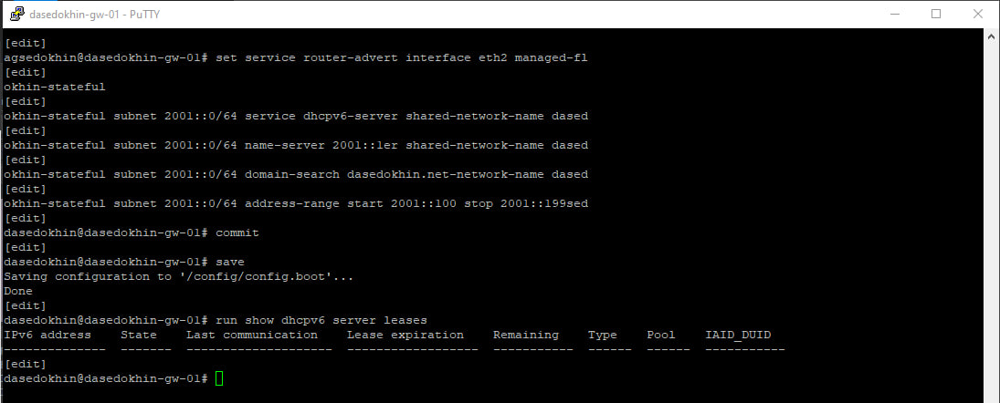{#fig-017 width=70%}

Подключитесь к узлу PC3 и проверьте настройки сети:

root@PC3-username:/# ifconfig

root@PC3-username:/# route -n -A inet6

На узле PC3 проверьте настройки DNS:

root@PC3-username:/# cat /etc/resolv.conf
([рис. @fig-018]).

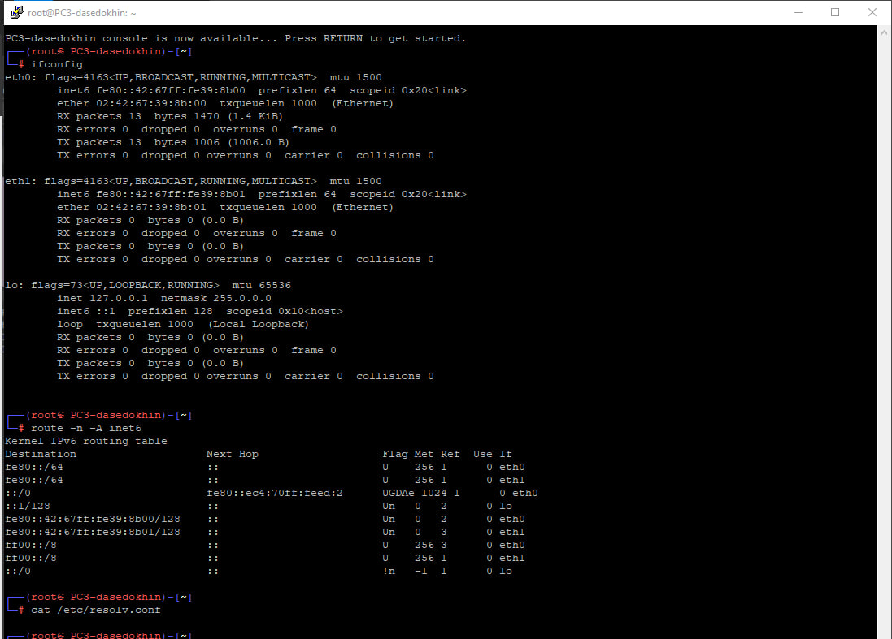{#fig-018 width=70%}

На узле PC3 получите адрес по DHCPv6:

root@PC3-username:/# dhclient -6 -v eth0
([рис. @fig-019]).

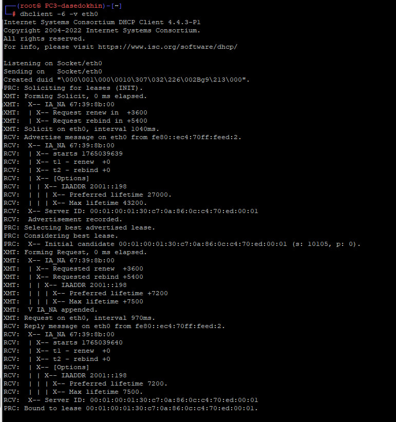{#fig-019 width=70%}

Вновь на узле PC3 проверьте настройки сети, пропингуйте маршрутизатор,
проверьте настройки DNS:

root@PC3-username:/# ifconfig

root@PC3-username:/# route -n -A inet6

root@PC3-username:/# ping 2001::1 -c 2

root@PC3-username:/# cat /etc/resolv.conf
([рис. @fig-020]).

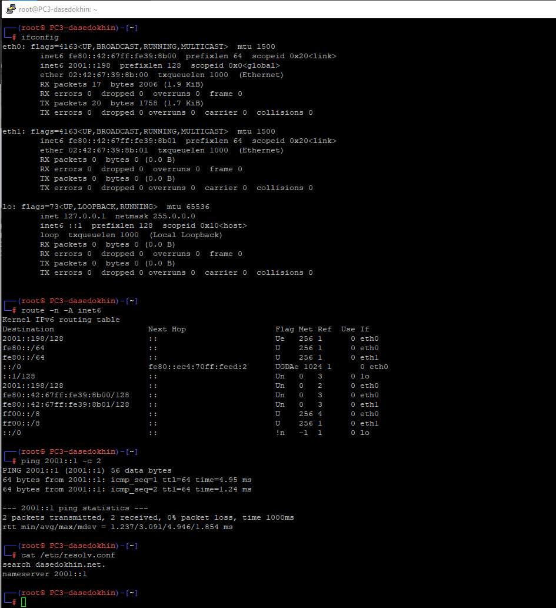{#fig-020 width=70%}

На маршрутизаторе посмотрите статистику DHCP-сервера и выданные адреса:

username@username-gw-01# run show dhcpv6 server leases
([рис. @fig-021]).

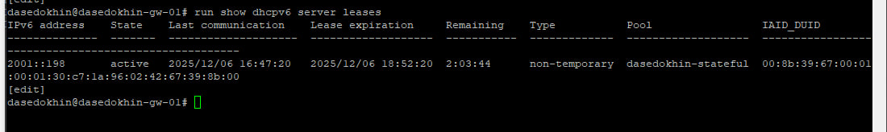{#fig-021 width=70%}

Анализ пакетов:
([рис. @fig-022]).

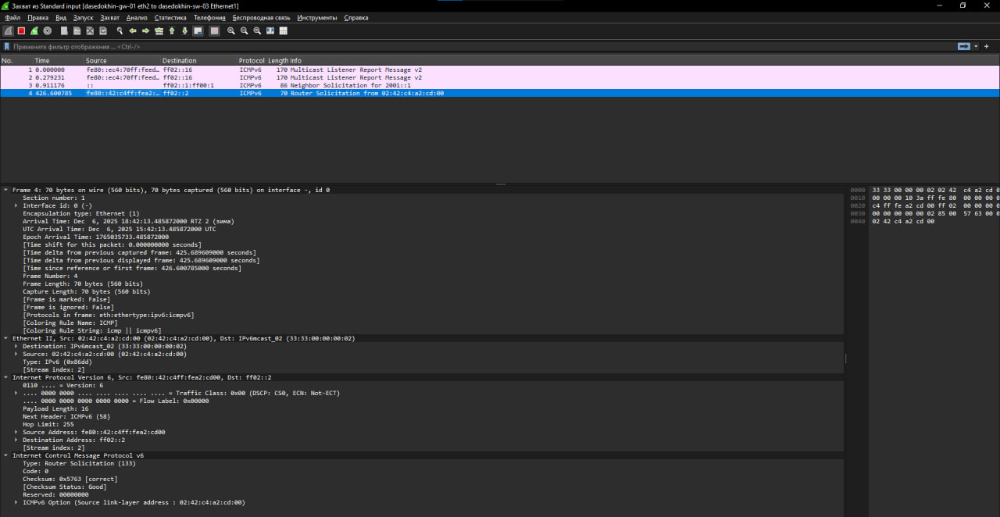{#fig-022 width=70%}

Анализ пакетов:
([рис. @fig-023]).

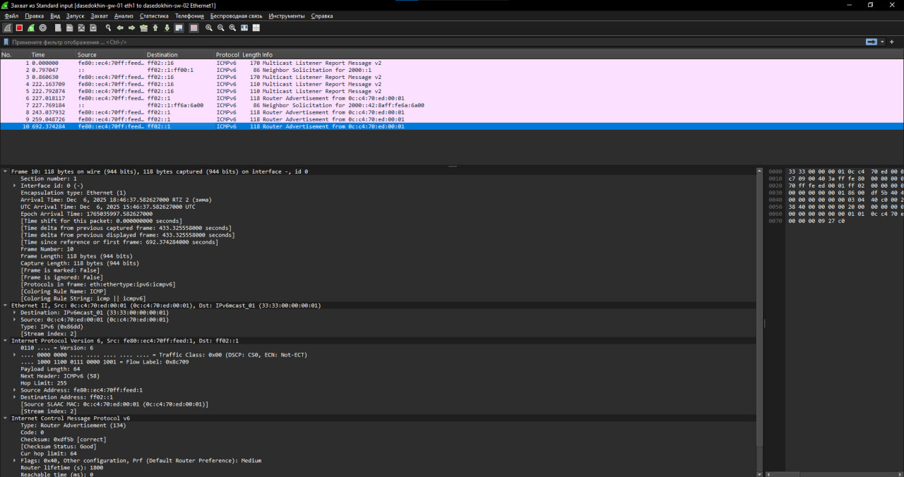{#fig-023 width=70%}

# Выводы

Я приобрел навыки по настройке службы DHCP на сетевом оборудовании для распределения адресов IPv4 и IPv6.
